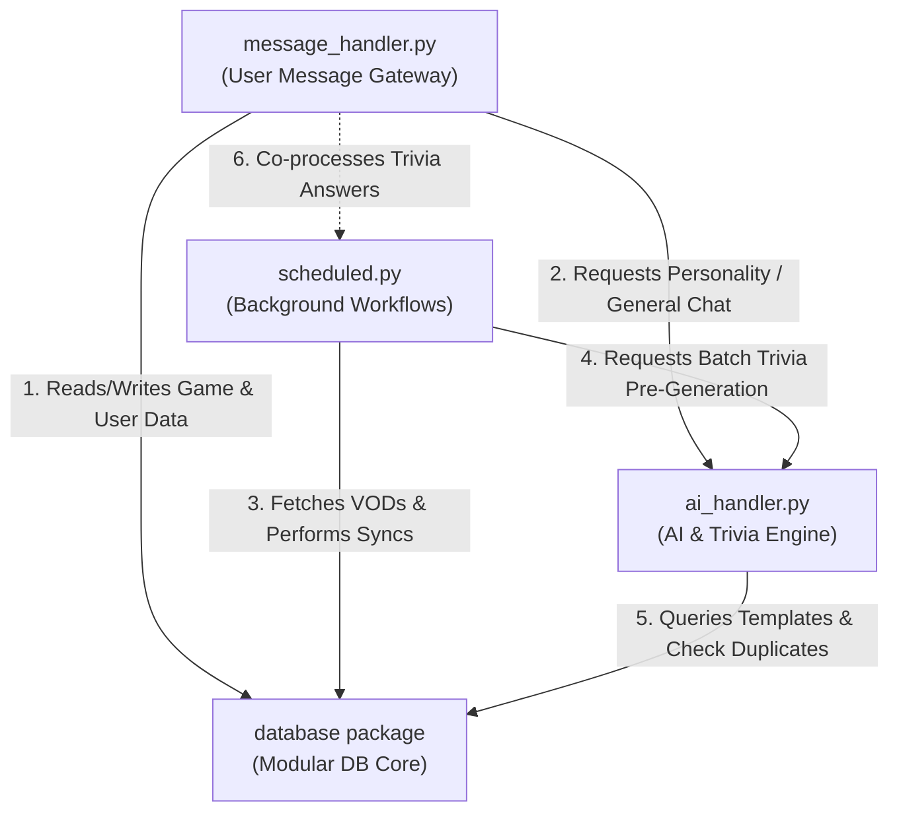
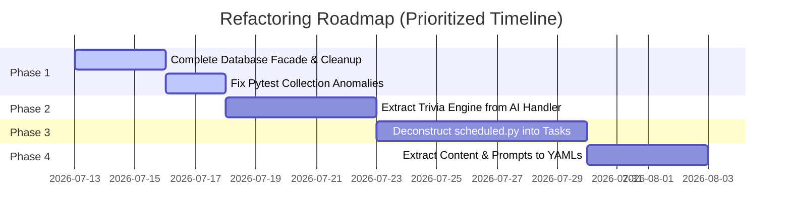

# Bot System Context: Ash Discord Bot

This document serves as the exhaustive architectural audit and source of truth for the Ash Discord Bot codebase, preparing the team for a structured technical debt refactoring sprint.

---

## 1. Repository Directory Structure & File Catalog

The codebase is organized in a modular structure centered under the `Live/` directory:

```text
Live/
├── bot_modular.py           # Bot initialization & main message event entry point
├── moderator_faq_data.py    # Legacy FAQ data lists (deprecated in favor of bot/persona)
├── moderator_faq_handler.py # Legacy FAQ matching handler (deprecated in favor of bot/persona)
├── bot/
│   ├── config.py           # Configuration values, environment IDs, static response templates
│   ├── database_module.py  # Legacy monolithic database manager (fallback)
│   ├── database_wrapper.py # Abstract delegation wrapper for backward compatibility
│   ├── main.py.backup      # Archive copy of early bot runner
│   │
│   ├── commands/           # Discord.py Cogs defining explicit commands
│   │   ├── announcements.py # Server-wide broadcasts & approval queues
│   │   ├── data_cleanup.py  # Normalizes played game series/genres & audits quality
│   │   ├── games.py         # Played games lookup & recommendation actions
│   │   ├── reminders.py     # Sets & cancels user reminders
│   │   ├── strikes.py       # Logs, lists, and resets user warning strikes
│   │   ├── trivia.py        # Starts, ends, and submits questions for Trivia Tuesday
│   │   └── utility.py       # Status reporting, latency checks, metadata diagnostics
│   │
│   ├── database/           # Domain-driven modular database access layer
│   │   ├── core.py          # Database connection pool & backward compatibility facade
│   │   ├── config.py        # Settings table dynamic reads/writes
│   │   ├── games.py         # Game catalog CRUD & Igdb caching
│   │   ├── sessions.py      # Staging approval workflows & review sessions
│   │   ├── stats.py         # Analytics tracking & VOD sync history
│   │   ├── trivia.py        # Active trivia lobbies & question banks
│   │   └── users.py         # Warnings/strikes, permissions, reminders tables
│   │
│   ├── handlers/           # Message controllers, validations, & flow routers
│   │   ├── ai_cache.py      # Response caching (prevents duplicate calls to Gemini)
│   │   ├── ai_handler.py    # Primary Gemini SDK client, backups, rate-limits & trivia engine
│   │   ├── ai_validation.py # Dynamic checks of generated trivia questions
│   │   ├── context_manager.py # Conversation context & pronoun resolution
│   │   ├── conversation_handler.py # Approval flows, sequential workflows, queues
│   │   ├── manual_game_input.py # Interactive moderator prompts for low-confidence games
│   │   ├── message_handler.py # Ingestion gateway, regex router, custom NLTK checks
│   │   ├── role_handler.py  # Automatic role upgrades (Trainee Space Cadet -> Spacecat)
│   │   └── twitch_view_response.py # Compiles platform analysis messages
│   │
│   ├── integrations/       # External service connector clients
│   │   ├── igdb.py          # Twitch OAuth-driven IGDB game catalog metadata
│   │   ├── twitch.py        # Stream details, active state, VOD logs
│   │   └── youtube.py       # Scans clips channels & syncs playlist uploads
│   │
│   ├── persona/            # Roleplay instructions, few-shot examples & static FAQ prompts
│   │   ├── context_builder.py # Compiles localized conversation histories
│   │   ├── examples.py      # Clinical, analytical few-shot responses
│   │   ├── faq_handler.py   # Maps matches to role-aware responses
│   │   ├── faqs.py          # Base FAQ mappings & safety fallback scripts
│   │   └── prompts.py       # Ash character System Instructions
│   │
│   ├── tasks/              # Scheduled background workers
│   │   ├── reminders.py     # Parses reminder timings from messages
│   │   └── scheduled.py     # Main scheduler, sync tasks, greeting triggers
│   │
│   └── utils/              # Base formatting and calculations helper package
│       ├── data_quality.py  # Cleans titles, normalizes genres/series
│       ├── dm_permissions.py # Checks if member allows DMs
│       ├── formatters.py    # Standardizes layout strings
│       ├── parsers.py       # Interprets numbers and commands
│       ├── permissions.py   # Admin/mod clearances, aliases
│       ├── test_gemini_models.py # Diagnostics script for API keys (conflict prefix)
│       ├── text_processing.py # Normalizes punctuations, rejects conversational titles
│       ├── time_utils.py    # Timezone adjustments
│       ├── trivia_formatting.py # Standardizes quiz outputs
│       ├── trivia_generation.py # Local mock generation helpers
│       └── trivia_parsing.py # Parses text questions
│
└── tests/                  # Pytest verification suites
    ├── conftest.py          # Shared fixtures & mocked DatabaseManager setup
    ├── requirements-test.txt # Packages required for runner
    ├── run_all_tests.py     # Local execution wrapper script
    ├── run_tests.sh         # Linux execution script
    ├── sync_staging.sh      # Pushes code to Rook branch
    ├── test_ai_integration.py # Checks mock AI filters
    ├── test_basic_modules.py # Checks python package imports
    ├── test_commands.py     # Validates Cog dispatch and syntax
    ├── test_config.py       # Checks static configuration files
    ├── test_database.py     # Checks PostgreSQL CRUD operations
    ├── test_functional_core.py # Verifies E2E workflows
    ├── test_role_handler.py # Verifies automatic space cadet promotion
    ├── test_trivia_response_simple.py # Confirms response inputs
    └── test_twitch_data_quality.py # Validates game name extraction algorithms
```

---

## 2. Critical Dependencies

The stability and execution of the bot rely on several critical external libraries and APIs:

| Dependency | Purpose | Criticality |
| :--- | :--- | :--- |
| `discord.py` | Core Discord API client library | **Blocker** (Bot cannot run without it) |
| `psycopg2` | PostgreSQL adapter for database transactions | **High** (Stops all stats/trivia if offline) |
| `nltk` | Natural Language Toolkit for sentence segmentation and token filtering | **Medium** (Degrades truncation/nlp query analysis) |
| **Google Gemini API** | Primary AI generation backend (Google Generative AI SDK) | **High** (Personality and AI trivia generation) |
| **Hugging Face Hub** | Secondary AI provider fallback (Claude 3 Haiku) | **Medium** (Acts as rate-limit/outage fallback) |
| **YouTube Data API** | Scans #clips channels and playlists for gaming statistics sync | **Medium** (Stops weekly stats updates) |
| **Twitch / IGDB API** | Fetches official game names, genres, and platforms | **Medium** (Stops game name enrichment and verification) |

---

## 3. Relationship Map (The Core Quadrumvirate)

The central logic of the bot is coordinated by the relationships between four key modules:



### I. `message_handler.py` ──► `database`
- Queries `get_database()` on start to get a reference to the `DatabaseManager` singleton.
- Calls `db` queries to get player statistics, check if games have been played, list played games by genre/year, and update user strikes/reminders.
- Loads conversational context states (such as active game context) from the `ConversationContext` records.

### II. `message_handler.py` ──► `ai_handler.py`
- Passes general user chat prompts to `call_ai_with_rate_limiting()` when the message does not match a database gaming query.
- Uses `filter_ai_response()` to clean trailing strings or block unauthorized tokens.
- Queries `detect_user_context()` from `ai_handler.py` to format role-aware FAQ responses.

### III. `scheduled.py` ──► `database`
- Syncs YouTube playlist and Twitch VOD uploads into the `played_games` database during the weekly `monday_content_sync()`.
- Updates dynamic scheduler config values and retrieves pending reminders via `check_due_reminders()`.
- Fetches active and emergency trivia session states for cleanups.

### IV. `scheduled.py` ──► `ai_handler.py`
- Calls `generate_trivia_batch()` during off-peak hours to pre-generate trivia questions.
- Initiates weekly announcement content creation tasks via `create_ai_announcement_content()`.

### V. `ai_handler.py` ──► `database`
- Retrieves the question history from `db.trivia` to perform duplicate checks and ensure the bot doesn't ask identical trivia questions.
- Pulls game list metadata and template settings from `db.games` and `db.config` to drive context injection.

---

## 4. Message Data Flow Map

```
  [ Discord Message Ingested ]
               │
               ▼
   [ bot_modular.py: on_message() ]
               │
               ├─► [Traditional command "!"] ──────► bot.process_commands() (Cog execution)
               ├─► [Active Trivia Reply] ──────────► process_trivia_answer() (Trivia score)
               ├─► [DM Interaction] ───────────────► message_handler: handle_dm_conversations()
               ▼
   [Is Bot Mentioned / Implicit Game Query?]
               │
               ├──► [No] ──► Drop / Ignore
               ▼ [Yes]
   [ message_handler: process_gaming_query_with_context() ]
               │
               ├─► 1. handle_trivia_reply() / handle_dm_conversations()
               ├─► 2. handle_context_aware_query() (Checks pending context clarifications)
               ▼
   [ message_handler: route_query() ]
               │
               ├─► [NLTK Parser] enhance_query_parsing()
               │       ├─► nltk.tokenize.word_tokenize()
               │       ├─► Filters NLTK English stopwords
               │       └─► Logs parsed keywords (NOT used for routing)
               │
               ├─► [Regex Router] Matches query against patterns (playtime, genre, platform, etc.)
               │       ├─► [Match Found] ──► Queries Modular DB ──► Formats Sarcastic Reply ──► Send
               │       └─► [No Match] ──► Returns False
               ▼
   [ message_handler: handle_general_conversation() ]
               │
               ├─► Check FAQ ──► Return FAQ text if matched
               ├─► Check Announcement Creation intent ──► Trigger workflow
               ▼ [Fallback to AI]
   [ ai_handler: call_ai_with_rate_limiting() ]
               │
               ├─► 1. Check Rate Quota limits (daily/hourly tracking)
               ├─► 2. build_full_system_instruction() (Injects Ash character + user context)
               ├─► 3. Call Google Gemini 1.5 Flash (Falls back to Claude via HF on failure)
               ├─► 4. filter_ai_response()
               ▼
        [ Send Response to User ]
```

---

## 5. Identified Architectural Risks

During this comprehensive code audit, four major architectural risks were identified:

### 1. Monolithic Hotspots (Violation of Modularity)
The codebase has been partially modularized, but three massive monolithic files contain the bulk of the bot's logic:
- **`ai_handler.py` (~3,500 lines):** Combines raw API interface code (Gemini SDK integration), rate-limiting state, progressive error penalties, prompt building, **AND** the entire trivia generation engine (template weight selection, syntax logic evaluation, duplication checking, and batch generation).
- **`scheduled.py` (~3,200 lines):** Combines job timing, raw Twitch/YouTube API parsing, regex-based name-cleaning heuristics for VOD titles, morning greeting generators, emergency approval states, and background question tasks.
- **`message_handler.py` (~2,400 lines):** Houses routing regex tables, DB statistic formatting methods, context tracking handlers, DM flow sub-managers, and role-checking modules.

### 2. Incomplete Facade & Database Inconsistency
- The database migration from the legacy `database_module.py` to the modular package `bot/database/` utilizes a backward-compatibility facade in `bot/database/core.py`.
- **The Issue:** Several new domain-specific methods (such as `get_games_by_series_organized` inside `database/games.py`) were implemented in the modules but **never added** to the facade in `core.py`.
- **The Impact:** Any component calling `db.get_games_by_series_organized()` will raise an `AttributeError`, causing integration failures (e.g., the failing test in `test_twitch_data_quality.py`). Callers are forced to bypass the facade by calling `db.games.get_games_by_series_organized()`, defeating the purpose of a unified legacy interface.
- **Redundancy:** The legacy `database_module.py` still resides in the bot folder and serves as a fallback import, meaning duplicate copies of database code are maintained.

### 3. Dead/Unused NLTK Query Parsing Code
- The routing of incoming messages is initiated via `route_query()` in `message_handler.py`. 
- **The Issue:** It calls `query_analysis = enhance_query_parsing(content)`, which downloads and runs NLTK tokenizer/stopword filters. However, `query_analysis` is **only printed/logged for debugging** and is never used in the routing logic. The routing logic instead falls back to looping over massive regular expression dictionaries.
- **The Impact:** Unnecessary processing overhead, a bloated dependency footprint (requiring local download of NLTK Corpora in Docker/Railway), and misleading code design that suggests NLTK drives routing when it is actually done via brittle regular expressions.

### 4. Hardcoded Content Design (Separation of Code & Copy)
- **The Issue:** The bot mixes system logic (routing/DB execution) with content copy. Sarcastic responses (like Pizza enforcement options) are hardcoded inline inside `message_handler.py`. 
- **The Good:** Prompt structures, tone instructions, and FAQs are successfully isolated in `Live/bot/persona/` (e.g., `prompts.py`, `examples.py`, `faqs.py`). 
- **Refactoring Requirement:** These Python-wrapped constants should be shifted to a `/content` configuration directory containing static YAML/JSON files, completely separating system execution files from text adjustments.

---

## 5. Review of the Testing Strategy

The developer branch contains a structured testing system using `pytest` that integrates with a PostgreSQL container in GitHub Actions:

### Existing Suite
- **`test_functional_core.py`:** Main E2E verification file checking user flows, context, and basic command routing.
- **`test_database.py`:** Validates PostgreSQL CRUD actions, stats computations, and transaction safeties.
- **`test_commands.py` & `test_ai_integration.py`:** Tests mock commands and filters.
- **`test_twitch_data_quality.py`:** Validates the parser and normalization rules.

### Identified Test Suite Flaws
1. **Unintentional Test Collection:** `Live/bot/utils/test_gemini_models.py` is named with a `test_*.py` prefix. Because local environments run `pytest` without path overrides, it attempts to collect this script. The script calls `sys.exit(1)` immediately if API keys are missing, crashing the entire test collection run before a single test is executed.
2. **Missing Asserts:** Several tests in `test_trivia_response_simple.py` and `test_basic_modules.py` return `True` or `False` instead of using standard `assert` blocks, triggering Pytest `PytestReturnNotNoneWarning` warnings.
3. **Facade Failure:** The test `test_series_organization_query` is failing consistently in the develop branch due to the missing delegation facade issue (calling `db.get_games_by_series_organized()` instead of `db.games...`).

---

## 6. Refactoring Modularity Prioritization

To resolve technical debt systematically, we recommend prioritizing future refactoring sprints as follows:



### Phase 1: Database & Test Stability (Immediate)
- **Action A:** Add the missing delegation methods (like `get_games_by_series_organized`) to `bot/database/core.py`.
- **Action B:** Rename `Live/bot/utils/test_gemini_models.py` to `verify_gemini_models.py` so it is ignored by the test runner, and resolve Pytest return value warnings.
- **Action C:** Safely remove the legacy fallback file `bot/database_module.py` once modular imports are validated as stable in staging.

### Phase 2: AI Handler Separation (High Priority)
- **Action:** Split `ai_handler.py` into:
  - `bot/handlers/ai/client.py`: Handles Gemini rate-limiting, connection retry, and model fallbacks.
  - `bot/handlers/ai/prompts.py`: Handles persona and prompt building.
  - `bot/handlers/trivia/generator.py`: Contains the trivia question generation engine.
  - `bot/handlers/trivia/evaluator.py`: Handles trivia answer parsing, matching, and score evaluations.

### Phase 3: Scheduled Tasks Modularization (High Priority)
- **Action:** Split `scheduled.py` into distinct task domains inside `bot/tasks/`:
  - `bot/tasks/sync_vods.py`: Dedicated Twitch/YouTube VOD fetch and sync script.
  - `bot/tasks/greetings.py`: Handles Friday, Monday, and Tuesday greetings.
  - `bot/tasks/trivia_preflight.py`: Preflight approvals and background question generators.
  - `bot/tasks/scheduler.py`: A lightweight task runner that triggers the sub-scripts.

### Phase 4: Separation of Content and Code (Medium Priority)
- **Action:** Extract persona strings, pizza warnings, and FAQs into a structured `/content` configuration directory containing YAML files. Update `config.py` and `moderator_faq_handler.py` to read from these files dynamically.
